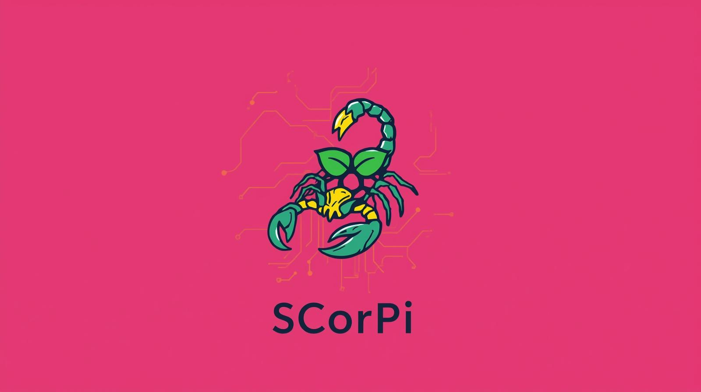

# Beowulf cluster on Raspberry Pi



## Overview

This repository provides scripts and resources to automate the deployment, management, and usage of a Beowulf-style computing cluster built of Raspberry Pi nodes. The `arch` folder is the core of the repository, containing all the scripts and configuration files necessary for cluster orchestration, setup, rollback, and distributed computation using MPI and NFS.

---

## The `arch` Folder: Structure and Functionality

The `arch` directory contains the following files:

- **cluster.env**  
  Environment configuration file defining cluster-wide variables such as master node hostname, node hostname list, shared working directories, MPI hostfile, node/core counts, etc.

- **cluster_build.sh**  
  Orchestrates setup and rollback operations for the entire cluster. It automates copying scripts to nodes, executing setup/rollback scripts (either in parallel or sequentially), and cleanup. Usage:  
  ```
  ./cluster_build.sh {setup|rollback}
  ```

- **cluster_run.sh**  
  Automates the deployment and distributed execution of binaries across the cluster. It:  
    - Copies the specified project folder to the master’s NFS share.
    - Compiles the code (with `make`, supporting distributed or serial builds).
    - Executes the resulting binary using `mpirun` according to specified parallelization options (`--all-cores`, `--one-core`, `--serial`), leveraging the environment and hostfile.
  Example usage:  
  ```
  ./cluster_run.sh <binary_name> <folder> [--all-cores | --one-core | --serial] -- [args for binary]
  ```

- **setup.sh**  
  Handles the installation and configuration of a node (as master or worker):  
    - Installs required packages (OpenMPI, NFS, etc.).
    - Sets up passwordless SSH keys and distributes them to nodes.
    - Prepares the MPI hostfile.
    - Configures NFS server (master) or client (nodes), ensuring persistent mounts.
    - Differentiates actions according to node role (`master` or `node`).

- **rollback.sh**  
  Provides a full uninstallation and cleanup routine for both master and worker nodes:  
    - Removes installed packages and dependencies.
    - Deletes SSH keys and authorized_keys from all nodes.
    - Cleans up the MPI hostfile.
    - Unmounts and removes NFS shares, edits `/etc/exports` and `/etc/fstab` accordingly.
    - Handles both server (master) and client (node) roles.

---

## The `algo` Folder: General Description

The `algo` directory is intended as a workspace for placing algorithm implementations and parallel/distributed computing experiments to be executed on the cluster. Users can add their own algorithm source code, test programs, and project folders here, which can then be compiled and run across the cluster nodes using the tools provided in the `arch` folder. This separation allows for a clean distinction between system management scripts (`arch`) and computational workloads or research projects (`algo`).

---

## How the `arch` Folder Works

1. **Configuration**  
   - Edit `cluster.env` to specify the master, nodes, and cluster parameters.

2. **Cluster Setup**  
   - Run `./cluster_build.sh setup` from the `arch` folder.
   - This action securely copies all necessary scripts and environment files to each node and triggers node-specific setup (`setup.sh master` or `setup.sh node`).

3. **Running Distributed Code**  
   - Use `./cluster_run.sh` to copy, compile, and execute a program across the cluster with your chosen parallelization strategy.

4. **Cluster Rollback**  
   - To completely uninstall and clean your cluster, run `./cluster_build.sh rollback`.  
   - This will invoke `rollback.sh` on all nodes, removing packages, SSH keys, shares, and configuration files.

---

## Getting Started

1. Prepare Raspberry Pi nodes with SSH access and network connectivity.
2. Clone this repository and navigate to the `arch` folder.
3. Edit `cluster.env` to reflect your cluster topology.
4. Initialize the cluster:
   ```
   ./cluster_build.sh setup
   ```
5. Deploy and run your parallel workload:
   ```
   ./cluster_run.sh <binary_name> <folder> --all-cores --
   ```
6. To teardown:
   ```
   ./cluster_build.sh rollback
   ```

## Cluster Node Flexibility

Although this repository is designed and tested using Raspberry Pi devices as nodes, the architecture and scripts in the `arch` folder are written generically and do not depend on Raspberry Pi-specific features. **In principle, any type of device capable of running a compatible Linux distribution, supporting SSH, NFS, and OpenMPI, can be used as a node in the cluster.** This includes other single-board computers, virtual machines, desktops, or servers.

When using non-Raspberry Pi devices, ensure all nodes:
- Run a compatible Linux environment.
- Support passwordless SSH access.
- Have required packages (`nfs-common`, `openmpi-bin`, etc.) available.
- Are configured correctly in `cluster.env`.

This flexibility allows the cluster to scale up and adapt for experimentation or production use with heterogeneous hardware.

---
